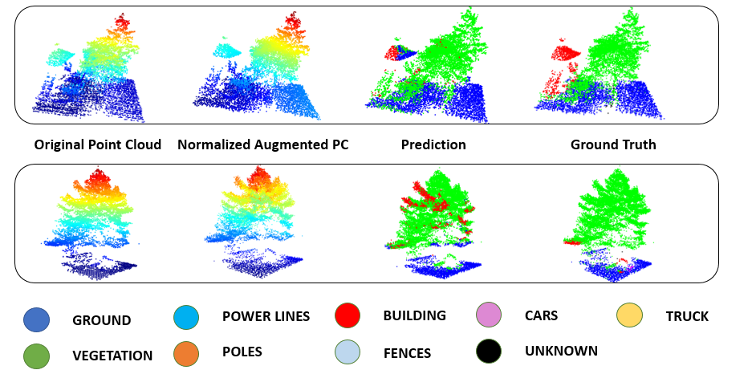

<!-- PROJECT LOGO -->

    
 
# PyTorch Pointnet++ Segmetation on DALES dataset

 

<!-- ABOUT THE PROJECT -->
## About The Project

<!-- GETTING STARTED -->
## Setup

<!-- USAGE -->
## Usage

<!-- ROADMAP -->
## Roadmap

<!-- CONTRIBUTING -->
## Contributing

Contributions are what make the open source community such an amazing place to be learn, inspire, and create. Any contributions you make are **greatly appreciated**.

1. Fork the Project
2. Create your Feature Branch (`git checkout -b feature/AmazingFeature`)
3. Commit your Changes (`git commit -m 'Add some AmazingFeature'`)
4. Push to the Branch (`git push origin feature/AmazingFeature`)
5. Open a Pull Request

<!-- LICENSE -->
## License

Distributed under the MIT License. See `LICENSE` for more information.

<!-- Authors -->
## Author

Harvey Pham 
[@Linkedin](https://www.linkedin.com/in/harveyphm/) 
Email: qhuy.phm@gmail.com

<!-- ACKNOWLEDGEMENTS -->
## Acknowledgements

## Thank you

