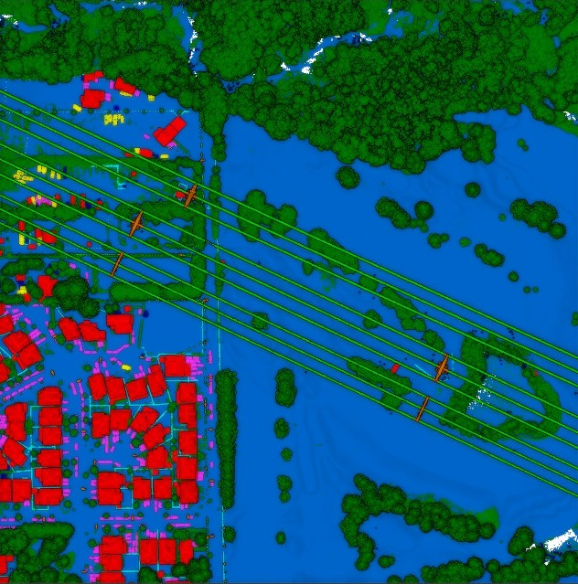

<!-- PROJECT LOGO -->

    
 
# PyTorch Pointnet++ Segmetation on DALES dataset

 

This project aims to leverage [PointNet++](https://arxiv.org/pdf/1706.02413), a successor of [PointNet](https://arxiv.org/abs/1612.00593) to perform semantic segmentation on point cloud obtain form Airborne Laser Scanner (ALS) such as DALES dataset using [Pytorch](https://pytorch.org/) and [Pytorch Geometrics](https://pyg.org/).

The pretrained model is trained with 39 epoches on the total of 60 millions points using Adam optimizer with fixed learning rate of 0.001. 
Then, the model is evaluated on the test dataset which consist of around 22 millions points.

| Tile size | Metrics | Ground | Vegetation | Car  | Truck | Powerline | Fence | Poles | Building | OA  |
|-----------|---------|--------|------------|------|-------|-----------|-------|-------|----------|-----|
| 15x15     | Precision | 0.93 | 0.93       | 0.39 | 0.18  | 0         | 0     | 0     | 0.81     | 0.9 |
|           | Recall    | 0.95 | 0.87       | 0.08 | 0.2   | 0         | 0     | 0     | 0.88     |     |
|           | IOU       | 0.94 | 0.9        | 0.132| 0.103 | 0         | 0     | 0     | 0.73     |     |
| 25x25     | Precision | 0.91 | 0.938      | 0.18 | 0.1   | 0         | 0     | 0     | 0.49     | 0.85|
|           | Recall    | 0.87 | 0.87       | 0.2  | 0.2   | 0         | 0     | 0     | 0.6      |     |
|           | IOU       | 0.8  | 0.82       | 0.103| 0.1   | 0         | 0     | 0     | 0.43     |     |

<!-- DATASET -->
## Dataset

DALES dataset was collected by University of Daytons using a Riegl Q1560 dualchannel. The entire aerial LiDAR collection spanned $330 km^2$ over the City of Surrey in British Columbia, Canada. However, only $10 km^2$ of data has labels. 

 

The dataset consist of 505 millions points which places it at the biggest dataset for ALS at that time.

There are 8 categories, labelled as follow:
- 0: Unknowns
- 1: Ground
- 2: Vegetation
- 3: Cars
- 4: Truck 
- 5: Power line
- 6: Fences
- 7: Poles
- 8: Building

For more information about DALES dataset, please visit this [site](https://udayton.edu/engineering/research/centers/vision_lab/research/was_data_analysis_and_processing/dale.php)

<!-- GETTING STARTED -->
## Setup 

<!-- USAGE -->
## Usage

<!-- ROADMAP -->
## Roadmap

<!-- CONTRIBUTING -->
## Contributing

Contributions are what make the open source community such an amazing place to be learn, inspire, and create. Any contributions you make are **greatly appreciated**.

1. Fork the Project
2. Create your Feature Branch (`git checkout -b feature/AmazingFeature`)
3. Commit your Changes (`git commit -m 'Add some AmazingFeature'`)
4. Push to the Branch (`git push origin feature/AmazingFeature`)
5. Open a Pull Request

<!-- LICENSE -->
## License

Distributed under the MIT License. See `LICENSE` for more information.

<!-- Authors -->
## Author

Harvey Pham 
[@Linkedin](https://www.linkedin.com/in/harveyphm/) 
Email: qhuy.phm@gmail.com

<!-- ACKNOWLEDGEMENTS -->
## Acknowledgements

## Thank you

